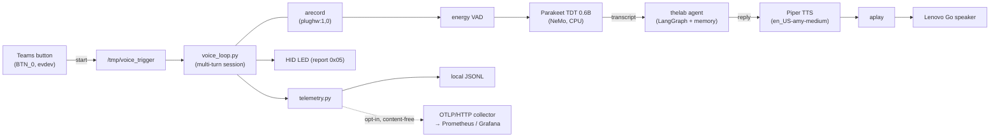

# conversational-voice-agent

A button-driven, **fully-local** voice agent running on an NVIDIA DGX Spark: press the Teams button on a USB speakerphone, speak, and hear a spoken reply — with no cloud speech services in the loop.

> **Personal learning project.** I built this to learn how the pieces of a local
> voice assistant fit together on real hardware: on-device speech-to-text, an
> agent "brain," neural text-to-speech, half-duplex USB audio, Linux input/HID
> plumbing, and content-free observability. It is a Phase-1 spike / prototype,
> not a product — the goal was understanding, honestly measured, not benchmarks
> to brag about.

## What it does

Press the Teams button to start a session. The agent says "Ready." You speak;
it transcribes, thinks, and speaks back — multi-turn, until you press the button
again (which also interrupts speech mid-sentence). The LED is solid while
services are ready and blinks when a session ends.

```
   Teams button                                          Lenovo Go speaker
   (BTN_0, evdev)                                          (plughw:1,0)
        │                                                        ▲
        ▼                                                        │
  button_listener.py ──"start"──▶ /tmp/voice_trigger            aplay
        │                              │                          ▲
        │ volume dial / LED            ▼                          │
        │                        voice_loop.py (session loop)     │
        │            ┌───────────────────────────────────────────┤
        │            │  arecord ─▶ energy VAD ─▶ Parakeet STT (NeMo, CPU)
        │            │        └─▶ text ─▶ thelab agent (LangGraph brain)
        │            │                       └─▶ reply ─▶ Piper TTS ─┘
        │            │  LED control (HID report 0x05)
        │            └─▶ telemetry (JSONL + optional OTLP metrics)
        ▼                                        │
   HID LED                                       ▼
                              OTLP/HTTP collector → Prometheus/Grafana
                              (opt-in, content-free: durations/counts only)
```



The **brain is a separate repo**: [`thelab`](https://github.com/derekclair/thelab)
holds the LangGraph agent and its long-term memory. This split keeps concerns
clean — **this repo is the ears, mouth, hands, and telemetry; `thelab` is the
brain and memory.** The brain is optional: `make smoke` runs the voice I/O path
with no brain and no API keys at all.

## The interesting engineering

- **Half-duplex USB-audio arbitration.** The Lenovo Go cannot record and play at
  the same time, and the device often reports "busy" for a moment after a
  capture ends. Mitigated with a settle delay plus `_robust_aplay`, which retries
  `aplay` with backoff when it sees a "device busy" error.
- **Energy-based VAD.** Recording ends after a tunable window of sub-threshold
  RMS audio (`SILENCE_SECONDS`), so the user can just stop talking — no
  push-to-hold. Deliberately simple (RMS on 100 ms chunks), not a neural VAD.
- **Interruptible TTS.** A shared `stop_event` is polled during playback; a
  button press terminates `aplay` immediately and ends the turn, so the agent
  never talks over you.
- **Hotplug re-discovery.** The button listener survives unplug/replug and USB
  port moves: it uses `pyudev` (with a timed-poll fallback) to notice add/remove
  events, re-discovers the evdev nodes and ALSA card index, and re-binds without
  a manual restart. LED discovery walks `/dev/hidraw*`.
- **Sentence-chunked TTS.** Multi-sentence replies start playing after the
  first sentence is synthesized (`local_tts/text_chunk.py`), so time-to-first
  audio does not wait on the full Piper pass.
- **Content-free telemetry.** Every turn emits structured events locally; an
  opt-in path forwards **only durations and counts** (never transcripts) to an
  OTLP metrics collector. See [Observability](#observability). Stage timers
  include end-of-utterance wait (`eou_ms`) and TTS time-to-first-audio
  (`tts_ttfa_ms`) as well as ASR / agent / TTS / total.

## Hardware & prerequisites

| Requirement | Detail |
|-------------|--------|
| Platform | NVIDIA DGX Spark (aarch64 / ARM64) — developed there; not otherwise portable |
| Speakerphone | Lenovo Go Wired Speaker (USB audio + HID), ALSA card discovered by name |
| Python | 3.11, run from a local `.venv` (no `pyproject.toml` — run as `python -m local_tts.<module>`) |
| STT | NVIDIA Parakeet TDT 0.6B via NeMo (CPU inference; ~2.5 GB downloaded on first run) |
| TTS | Piper voice `en_US-amy-medium` at `~/.local/share/piper-voices/`; falls back to espeak-ng |
| Permissions | user in `input` + `audio` groups; a udev rule for VID `17ef` / PID `a03f` so hidraw/input are writable without sudo |

Notes: on the DGX Spark there is no `nvidia-smi`, and `torch.cuda.is_available()`
may report `False` even with CUDA present — don't rely on it. The STT model runs
on the CPU path in this spike.

## Quick start

### a) Smoke test — no keys, no brain, no hardware theatrics

The fastest thing to try. Standalone LED + Piper TTS sanity check; does **not**
install `thelab` and needs **no API keys**.

```bash
make smoke
```

### b) Full voice agent

```bash
# 1. Install the companion brain first (so the editable install works):
#    git clone https://github.com/derekclair/thelab ../thelab && (cd ../thelab && make)

# 2. Create and fill in your keys:
cp .env.example .env      # or: make keys
#    edit .env — set at least XAI_API_KEY (and SUPERMEMORY_API_KEY for memory)

# 3. Run the agent, and the button listener in a second terminal:
make                       # Parakeet STT → thelab agent → Piper TTS on the Go
make button                # (2nd terminal) Teams button → /tmp/voice_trigger
```

`make` sets up the `.venv`, installs `thelab` as an editable dependency, checks
for your `.env`, and starts the voice loop. Then press the Teams button and speak.

### c) Local-only LLM (no hosted API)

Point the brain at a local Ollama model instead of a hosted provider:

```bash
make ollama                # defaults to qwen2.5:32b via http://localhost:11434/v1
OLLAMA_MODEL=llama3.2 make ollama
```

### Install as systemd user services (auto-start on boot)

```bash
make install     # enable + start local-tts.service and local-tts-buttons.service
make uninstall   # remove them
```

## Observability

Telemetry is **content-free / privacy tier-A by design**: transcripts and agent
replies **never leave the host**. The local JSONL fallback keeps full events for
your own debugging, but the export path only ever ships **durations and counts**.

To ship per-turn latency metrics to **any** OTLP/HTTP collector (an OpenTelemetry
Collector, then on to Prometheus/Grafana, or anything OTLP-compatible), set:

```bash
VOICE_OTEL_ENDPOINT=http://<collector-host>:4318
```

Base URL only — `/v1/metrics` is appended automatically. Export is **opt-in**:
with no endpoint set, the exporter is a no-op and nothing is sent.

**Emitted metrics** (OpenTelemetry instrument names; in Prometheus these appear
as `voice_turn_<name>_milliseconds_{sum,count,bucket}` and `voice_<name>_total`):

| Instrument | Type | Meaning |
|------------|------|---------|
| `voice.turn.asr_ms` | histogram | speech-to-text latency per turn |
| `voice.turn.agent_ms` | histogram | agent/LLM latency per turn |
| `voice.turn.tts_ms` | histogram | text-to-speech latency per turn |
| `voice.turn.total_ms` | histogram | end-to-end latency per turn |
| `voice.turn.eou_ms` | histogram | end-of-utterance silence wait per turn |
| `voice.turn.tts_ttfa_ms` | histogram | TTS time-to-first-audio per turn |
| `voice.turns_total` | counter | completed turns |
| `voice.errors_total` | counter | pipeline errors |
| `voice.turns_cancelled_total` | counter | turns cancelled by a button press |

As an alternative sink, this repo bundles a **self-contained observability stack**
in [`observability/`](observability/) (Docker Compose: Postgres + Loki + Grafana +
a small FastAPI ingest service) with its own `observability/.env.example`.

## Benchmark

One real session on this DGX Spark desk, 2026-08-19: three completed turns,
Lenovo Go speakerphone, Parakeet TDT 0.6B on CPU, Piper `en_US-amy-medium`,
thelab agent on hosted Grok. Generated with `bench/latency_report.py` from
local `turn_complete` telemetry (durations only; transcripts are not committed).

n=3 — these are descriptive numbers from one sitting, not a load test. With
three samples, p95 sits near the max. `tts_ms` is full synthesis **plus**
playback wall time; `tts_ttfa_ms` is time to first audio after sentence
chunking. `eou_ms` is the configured ~500 ms end-of-utterance silence wait.

| metric | count | p50 | p95 | min | max |
|--------|-------|-----|-----|-----|-----|
| asr_ms | 3 | 377 | 1308 | 355 | 1412 |
| agent_ms | 3 | 4069 | 5448 | 3477 | 5601 |
| tts_ms | 3 | 10967 | 13906 | 2001 | 14232 |
| total_ms | 3 | 15392 | 17818 | 9015 | 18087 |
| eou_ms | 3 | 499 | 500 | 499 | 500 |
| tts_ttfa_ms | 3 | 122 | 144 | 85 | 146 |

Generate the table yourself from telemetry:

```bash
# From the local JSONL fallback (exact percentiles):
python bench/latency_report.py --jsonl /tmp/local-tts-telemetry/events-*.jsonl

# Or from a Prometheus server fed by the OTLP exporter (count + mean exact,
# p50/p95 approximated from histogram buckets):
python bench/latency_report.py --prometheus http://<prometheus-host>:9090
```

The tool is standard-library only (no third-party imports). It reads
`turn_complete` events and reports count / p50 / p95 / min / max per metric.

## Repository layout

```
local_tts/voice_loop.py        Main loop: record → STT → agent → TTS → LED
local_tts/button_listener.py   Teams button + volume dial (hotplug-aware)
local_tts/led_control.py       Lenovo Go LED via HID report 0x05
local_tts/telemetry.py         Structured event emitter (JSONL + optional HTTP)
local_tts/otel_export.py       Opt-in, content-free OTLP latency metrics
local_tts/text_chunk.py        Sentence splitting for chunked Piper playback
local_tts/transcript.py        Durable per-session JSONL transcripts (local only)
local_tts/agent_io.py          Pure tool-call/result pairing helpers
bench/latency_report.py        Latency-table generator (stdlib only)
Makefile                       All build/run/install/cleanup targets
run_voice_loop.sh              Venv wrapper for the voice loop
systemd/                       User services for the loop and button listener
observability/                 Optional Docker Compose stack + Grafana dashboards
specs/                         Design specs for the spike (001–003, 005)
tests/                         Hardware-free unit tests
```

Common Makefile targets: `make smoke`, `make`, `make ollama`, `make button`,
`make demo`, `make keys`, `make install`/`make uninstall`, and cleanup helpers
`make audio-reset` / `make reset` (run `make help` for the full list). The
half-duplex audio device is the biggest gotcha — use `make audio-reset` if
playback gets stuck on "device busy."

## Limitations & status

- **Phase-1 spike.** A learning prototype, not a distributable package: no
  `pyproject.toml`, runs from a local `.venv`, tuned around one physical setup.
- **Single speakerphone.** Hard-wired to the Lenovo Go (VID `17ef` / PID `a03f`)
  and its half-duplex USB audio; other devices are untested.
- **No streaming / barge-in yet.** STT runs on completed utterances (not
  streaming partials in this build), and you interrupt by pressing the button
  rather than by speaking over the agent.
- **CPU STT.** Parakeet runs on the CPU path here; GPU inference is not wired up.
- **Small capture.** The latency table is one three-turn session, not a
  benchmark suite. Re-run `bench/latency_report.py` on your own telemetry
  rather than treating those percentiles as targets.

## License

See [LICENSE](LICENSE).
